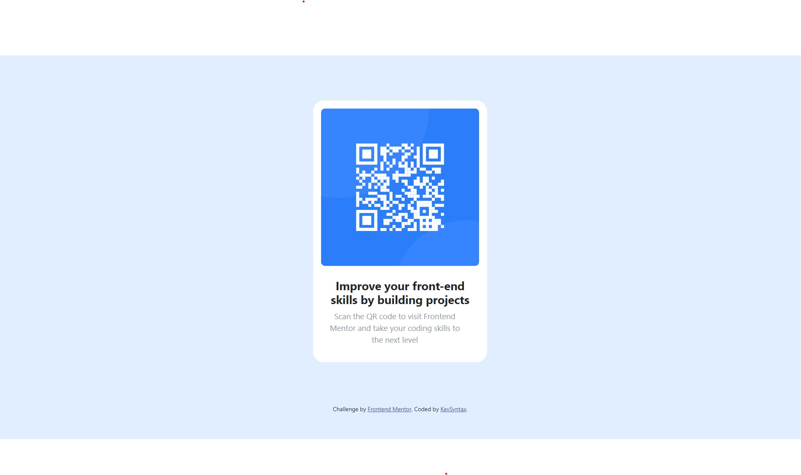

# Frontend Mentor - QR code component solution

This is a solution to the [QR code component challenge on Frontend Mentor](https://www.frontendmentor.io/challenges/qr-code-component-iux_sIO_H). Frontend Mentor challenges help you improve your coding skills by building realistic projects. 

## Table of contents

- [Overview](#overview)
  - [Screenshot](#screenshot)
  - [Links](#links)
- [My process](#my-process)
  - [Built with](#built-with)
- [Author](#author)

## Overview

### Screenshot

### Links

- Solution URL: [Add solution URL here](https://your-solution-url.com)
- Live Site URL: [Click Here](https://kevsyntax.github.io/qr-code-component/)

## My process

### Built with

- HTML5 
- CSS properties
- Flexbox
- [Bootstrap](https://getbootstrap.com/) - CSS library

## Author

- GitHub - [Kevin Chiemerie Amarah](https://github.com/KevSyntax)
- Frontend Mentor - [KevSyntax](https://www.frontendmentor.io/profile/KevSyntax)
- Twitter - [Kevin Amarah](https://www.twitter.com/Amarahkevin)

